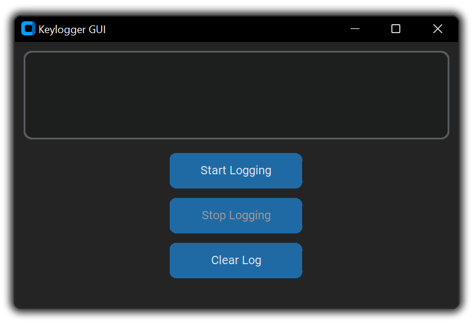

# ⌨️ KeyLogger

A simple keystroke logger with a easy to use GUI.

## ❔ Why?

I made this app quickly (w/ ChatGPT) to track things I was writing which I sometimes accidentally overwrite. This is NOT made for malicious purposes.

## ⚙️ Installation

1. Clone the repo.
2. Install dependencies.
3. Run `python app.py`.

Note: I've only tested this program on Windows 11, I don't know how it runs on other platforms.

## 🔜 Roadmap

I plan to add features I need for my daily use. You can find the planned features in `.todo`.
